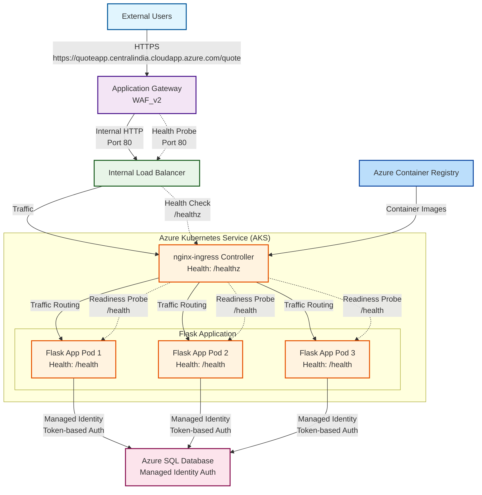
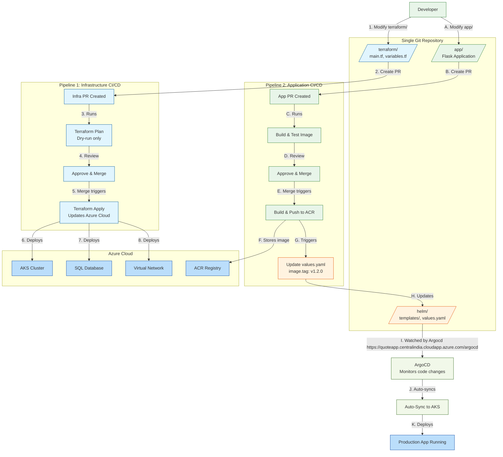

# Assessment 
create a public web application that connects to an Azure SQL database. The database should be seeded with a list of famous quotes, and when the site is accessed, it should query the database for a random quote and display it.

# Architecture
## System Overview



## Architecture Explanation

### Flow Description:
1. **External Traffic**: Internet users access via HTTPS/HTTP
2. **Application Gateway**: Azure WAF_v2 provides security
3. **Internal Load Balancer**: Distributes traffic within VNET
4. **Kubernetes**: nginx-ingress routes to Flask pods
5. **Database**: Azure SQL with managed identity
6. **Registry**: ACR stores container images

### Key Features:
- ✅ WAF protection
- ✅ Private networking
- ✅ Managed identity authentication
- ✅ Health monitoring at every layer

### Application Url's
web application - https://quoteapp.centralindia.cloudapp.azure.com/quote
Adgocd - https://quoteapp.centralindia.cloudapp.azure.com/argocd

## Complete CI/CD Pipeline with Terraform & ArgoCD

### Architecture Diagram



**Two Separate CI/CD Pipelines:**

1. **Infrastructure Pipeline** (`/terraform/` folder):
   - PR → `terraform plan` (safety check only)
   - Merge → `terraform apply` (deploys to Azure)

2. **Application Pipeline** (`/app/` folder):
   - PR → Build & test Docker image
   - Merge → Push to ACR → Update Helm → ArgoCD auto-deploys

**One-Line Summary:** Code → PR → Review → Merge → Auto-deploy to production
-  High availability with multiple pods
```
